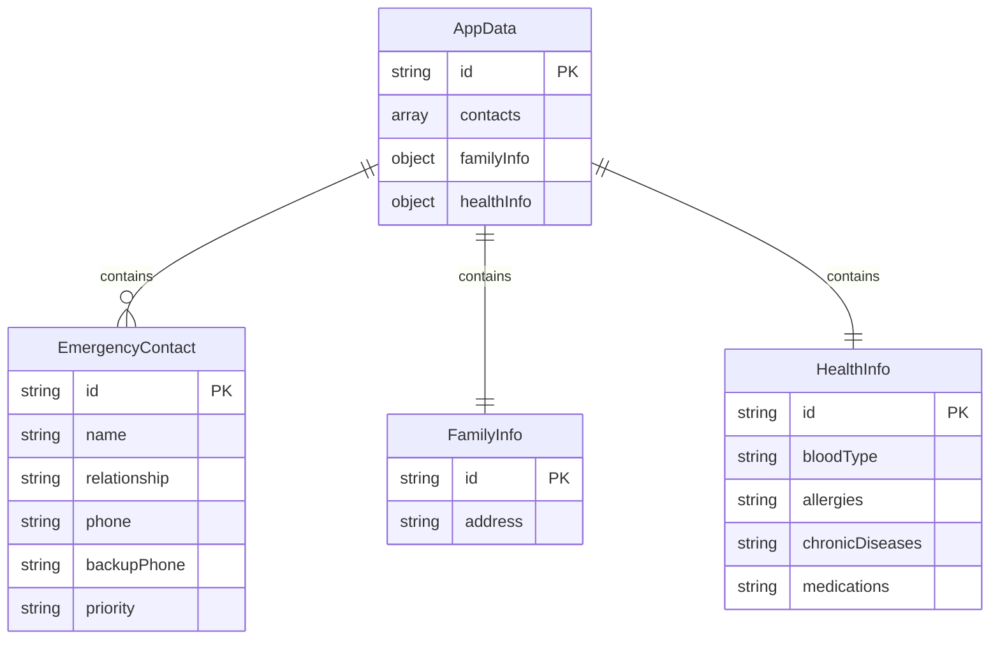

## 1. 架构设计

```mermaid
flowchart TD
    "A[React 前端应用]" --> "B[组件层]"
    "B" --> "C[紧急联系人组件]"
    "B" --> "D[家庭信息组件]"
    "B" --> "E[健康信息组件]"
    "B" --> "F[紧急卡片生成组件]"
    "A" --> "G[数据层]"
    "G" --> "H[localStorage 持久化]"
    "G" --> "I[React State 状态管理]"
    "A" --> "J[工具层]"
    "J" --> "K[卡片文本生成器]"
    "J" --> "L[剪贴板复制工具]"
```

## 2. 技术说明

- **前端**：React@18 + Tailwind CSS@3 + Vite
- **初始化工具**：Vite (vite-init)
- **后端**：无（纯前端应用）
- **数据库**：无（使用浏览器 localStorage 持久化）
- **状态管理**：React useState + useEffect，无额外状态库
- **数据持久化**：localStorage，自动保存，页面刷新数据不丢失

## 3. 路由定义

| 路由 | 用途 |
|------|------|
| / | 主页面，包含所有功能模块（联系人管理、家庭信息、健康信息、卡片生成） |

单页应用，无需多路由。

## 4. API 定义

无后端 API，所有数据在客户端本地处理。

## 5. 服务端架构图

无服务端。

## 6. 数据模型

### 6.1 数据模型定义



### 6.2 数据定义

```typescript
interface EmergencyContact {
  id: string;
  name: string;
  relationship: string;
  phone: string;
  backupPhone: string;
  priority: 'first' | 'second' | 'other';
}

interface FamilyInfo {
  address: string;
}

interface HealthInfo {
  bloodType: string;
  allergies: string;
  chronicDiseases: string;
  medications: string;
}

interface AppData {
  contacts: EmergencyContact[];
  familyInfo: FamilyInfo;
  healthInfo: HealthInfo;
}
```

数据存储键名：`family-emergency-data`，值为 AppData 的 JSON 字符串。
